# The Build Lab
Phillip Healy's Milestone Project 4: Full Stack Frameworks with Django. 
The Build Lab is a website for people to come and learn about various deck building games. From Collectable Trading Card Games like Magic The Gathering, Yu-gi-oh, etc. To Living Card Games like Android: Netrunner. I'm obscessed with building decks and putting together strategy for a competitive edge, fun deck techs, or pure casual fun.

For this project I thought a site centered around my love of card games, showing off some free advice and entertaining opinions on the games that are out there, as well as some content locked behind a paywall for more serious enthusiasts would be perfect.

At a certain point I realised my scope and content had gotten bloated and many things were not working. I tried to go to previous points in the version control and nothing ever felt right. I started again and used what I could to rebuild and get to a much cleaner more planned and directly designed place. This was a difficult and stressful desision, but I feel this paid off. I stuck with the same repo to preserve record of the work I had put in.

I went into this with so little time for many reasons, but worked myself to the bone to get it done and have something I can be proud of.

## Brief

### Project purpose: 

In this project, you'll build a full-stack site based around business logic used to control a centrally-owned dataset. You will set up an authentication mechanism and provide paid access to the site's data and/or other activities based on the dataset, such as the purchase of a product/service. 

### Value provided: 

1. By authenticating on the site and paying for some of its services, users can advance their own goals. Before authenticating, the site makes it clear how those goals would be furthered by the site. 

2. The site owner is able to make money by providing this set of services to the users. There is no way for a regular user to bypass the site's mechanisms and derive all of the value available to paid users without paying. 

### Project Requirements 

#### Main Technologies 

HTML, CSS, JavaScript, Python+Django 

Relational database (recommending MySQL or Postgres) 

Stripe payments 

Additional libraries and APIs 

#### Mandatory Requirements 

A project violating any of these requirements will FAIL: 

- Django Full Stack Project: Build a Django project backend by a relational database to create a website that allows users to store and manipulate data records about a particular domain. 

- Multiple Apps: The project must be a brand new Django project, composed of multiple apps (an app for each potentially reusable component in your project). 

- Data Modeling: Put some effort into designing a relational database schema well-suited for your domain. Make sure to put some thought into the relationships between entities. Create at least 2 custom django models beyond the examples shown on the course (changing the field names of the miniproject models is not customisation) 

- User Authentication: The project should include an authentication mechanism, allowing a user to register and log in, and there should be a good reason as to why the users would need to do so. e.g., a user would have to register to persist their shopping cart between sessions (otherwise it would be lost). 

- User Interaction: Include at least one form with validation that will allow users to create and edit models in the backend (in addition to the authentication mechanism). 

- Use of Stripe: At least one of your Django apps should contain some e-commerce functionality using Stripe. This may be a shopping cart checkout or single payments, or donations, etc. After paying successfully, the user would then gain access to additional functionality/content on the site. Note that for this project you should use Stripe's test functionality, rather than actual live payments. 

- Structure and Navigation: Incorporate a main navigation menu and structured layout (you might want to use Bootstrap to accomplish this). 

- Use of JavaScript: The frontend should contain some JavaScript logic you have written to enhance the user experience. 

- Documentation: Write a README.md file for your project that explains what the project does and the value that it provides to its users. 

- Version Control: Use Git & GitHub for version control. 

- Attribution: Maintain clear separation between code written by you and code from external sources (e.g. libraries or tutorials). Attribute any code from external sources to its source via comments above the code and (for larger dependencies) in the README. 

- Deployment: Deploy the final version of your code to a hosting platform such as Heroku. 

- Security: Make sure to not include any passwords or secret keys in the project repository. Make sure to turn off the Django DEBUG mode, which could expose secrets. 

## UX

### User Stories

- As a gamer I would like to see a collection of card games to play.
- As a boardgame enthusiast I would like to see entertaining opinions on various card games.
- As a casual Yu-gi-oh player I want to see if there's some tips on improving.
- As a professional Magic The Gathering player I want to see what others are doing with the new cards.
- As a competitive player I would like to see what game might be right for me to jump into.
- As a hobbyist I'd love to find out news about new cards and how they might change the current meta-game.
- As a fan I want to be able to register and support the site.

### Design

#### Wireframes

##### Mobile Pages

- Mobile Home
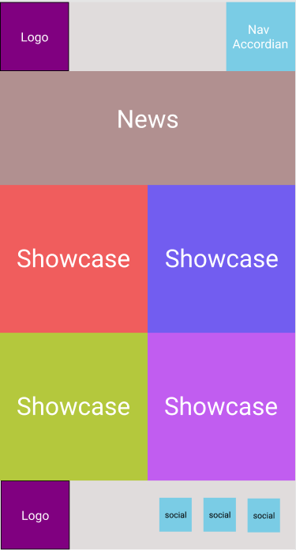

- Mobile News

- Mobile Store
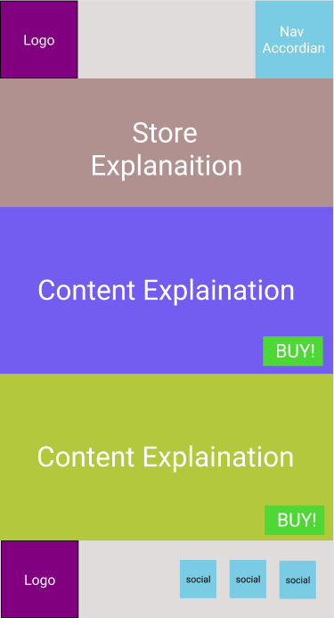

- Mobile Content
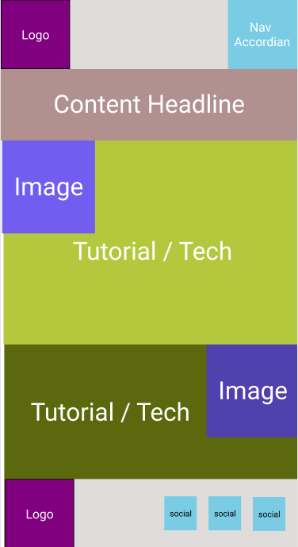

##### Desktop Pages

- Desktop Home
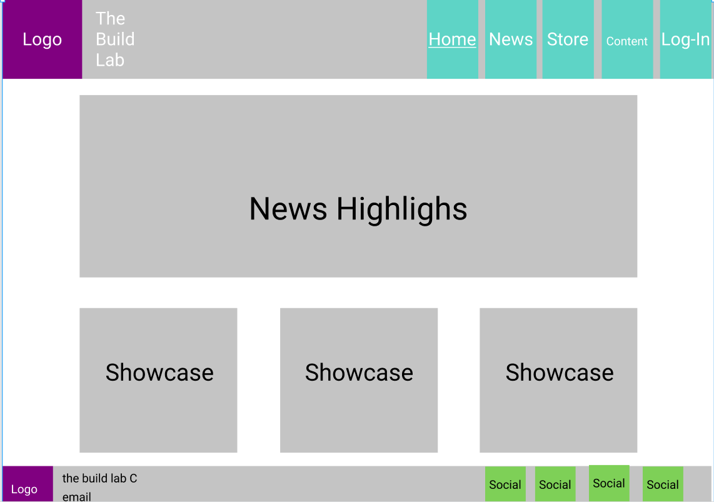

- Desktop News
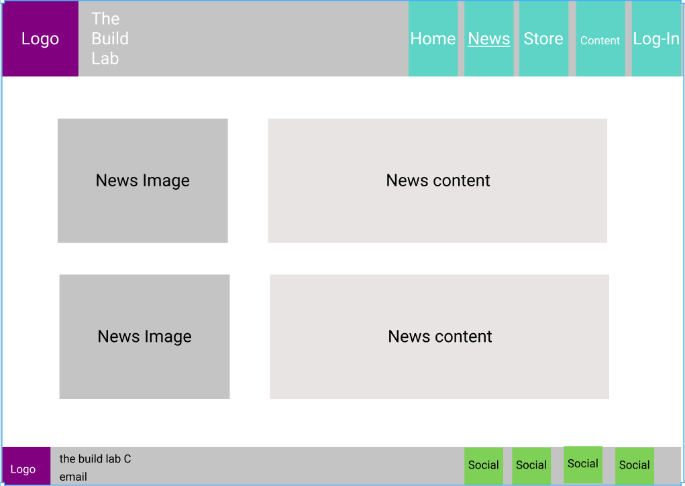

- Desktop Store
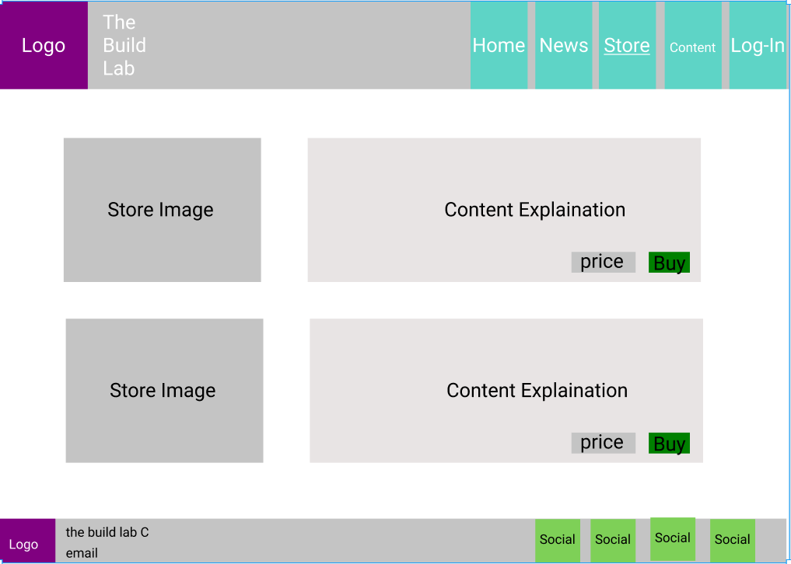

- Desktop Content
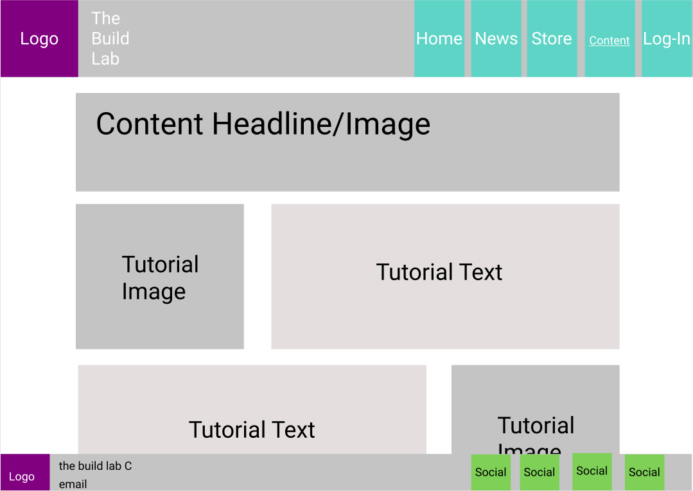

#### Schema

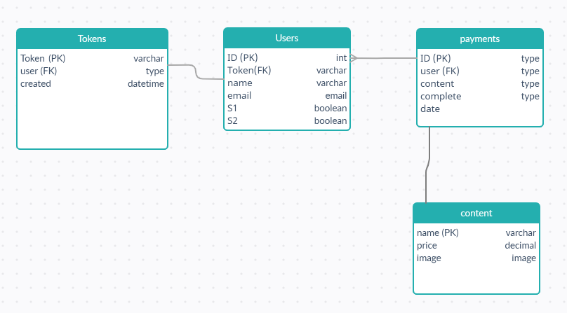

- Original schema was for a pay per season model where users would pay for the content they wanted and leave what they didn't. This made less sense as I continued building, because I'd like to encourage people to try more games, not just the ones they're used to. So a pay once and unlock everything model appealed to me way more:

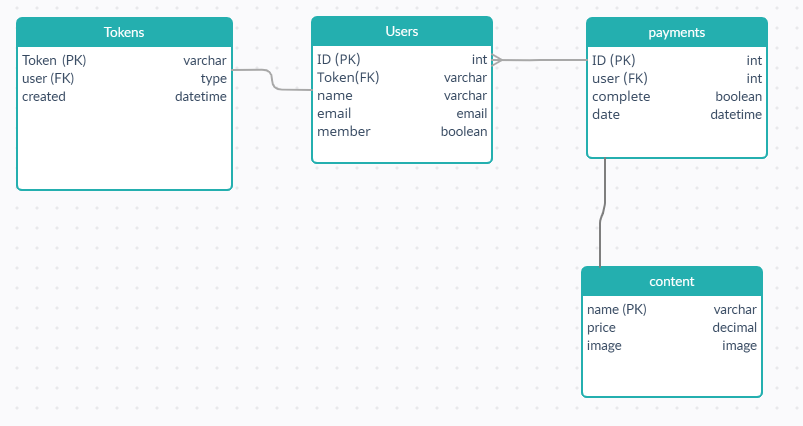

I chose to have the site be open and clean to maintain a great user experience. Keeping focus on the content the user has come for, while providing easy navigation to and from every part of the site. I chose a calm blue as my base palette as this represents wisdom and kindness, being complimented by orange which alludes to encouragement and motivation. This combination is perfect for a teaching platform which is centered around fun and learning.

For the font I chose Poppins; a free Google Font. Poppins is an internationalist take on geometric sans. Each letterform is nearly monolinear, 
with optical corrections applied to stroke joints where necessary to maintain an even typographic color. The Devanagari base character height and the Latin ascender height are equal; Latin capital letters are shorter than the Devanagari characters, and the Latin x-height is set rather high (https://fonts.google.com/specimen/Poppins#about).
I found this Font to be clean and clear at all font-weights, which is what I wanted in my consistent vision across the site.

## Features

### Existing Features

### Future Features

## Technologies Used

### Python
- Python is an interpreted high-level general-purpose programming language. Python's design philosophy emphasizes code readability with its notable use of significant indentation. 
 Its language constructs as well as its object-oriented approach aim to help programmers write clear, logical code. (https://pythonbasics.org/)

### Django
- Django is a high-level Python web framework that encourages rapid development and clean, pragmatic design. Built by experienced developers, it takes care of much of the hassle of web development, so you can focus on writing your app without needing to reinvent the wheel. (https://www.djangoproject.com/)

### SQLite
- SQLite is a relational database management system contained in a C library. In contrast to many other database management systems, SQLite is not a client–server database engine. Rather, it is embedded into the end program. SQLite generally follows PostgreSQL syntax. SQLite 3 was used for testing and early work in this project.

### PostgreSQL
- PostgreSQL, also known as Postgres, is a free and open-source relational database management system emphasizing extensibility and SQL compliance. It was originally named POSTGRES, referring to its origins as a successor to the Ingres database developed at the University of California, Berkeley. (https://mp.s81c.com/pwb-production/000001-partner/78/documentation/6253_en.pdf)

### ElephantSQL
- ElephantSQL will manage administrative tasks of PostgreSQL, such as installation, upgrades to latest stable version and backup handling. ElephantSQL is also integrated to several cloud application platforms (also known as PaaS). (https://mp.s81c.com/pwb-production/000001-partner/78/documentation/6253_en.pdf)

### Heroku
- Heroku is a cloud platform as a service supporting several programming languages. One of the first cloud platforms, Heroku has been in development since June 2007, when it supported only the Ruby programming language, but now supports Java, Node.js, Scala, Clojure, Python, PHP, and Go. (https://www.heroku.com/)

### Pillow 
- The Python Imaging Library adds image processing capabilities to your Python interpreter. This library provides extensive file format support, an efficient internal representation, and fairly powerful image processing capabilities. The core image library is designed for fast access to data stored in a few basic pixel formats. It should provide a solid foundation for a general image processing tool.

### Rest
- Django REST framework is a powerful and flexible toolkit for building Web APIs.
-- Using rest API token authentication for secure authentication and validation via tokens.

### Bootstrap
- Bootstrap is the most popular CSS Framework for developing responsive and mobile-first websites. (https://www.w3schools.com/whatis/whatis_bootstrap.asp)

### Balsamiq
- Balsamiq Wireframes is a rapid low-fidelity UI wireframing tool that reproduces the experience of sketching on a notepad or whiteboard, but using a computer. (https://balsamiq.com/wireframes/)

### Font Awsome
- Font Awesome is a font and icon toolkit based on CSS and Less. (https://fontawesome.com) Font awesome did not work, but was attempted.

## Testing

### Bugs Encountered

- Had pushed to github with secret key exposed in settings.py. Fixed this by linking to a .git-ignored file with a new secure key.

- While creating JS logic for event handlers to add items to cart on store page. Continually got error 'synthax error, unexpected identifier' to the console.

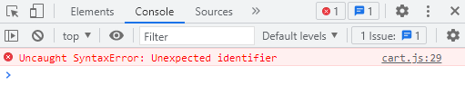

- I had a colon in the wrong place, this took too long to find for such a small issue!

- While trying to update cart with JSON fetch I was running into CSRF (Cross Site Request Forgery protection) token error on both the console and terminal.

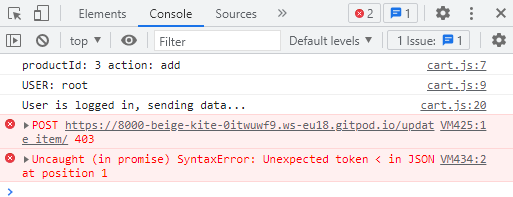

- Django docs had a JS script to sort this out by getting the cookie csrftoken and passing it through to the request handler.

- Request to pass data to backend is coming up with error saying "WSGIRequest object has no attribute 'data'"

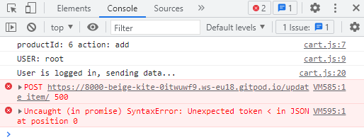

- Changed to "data = json.loads(request.body)" and the request sent successfully.

- Buttons on cart page wired to add/remove quantity on click event. Giving error of unexpected token on JSON line 0.

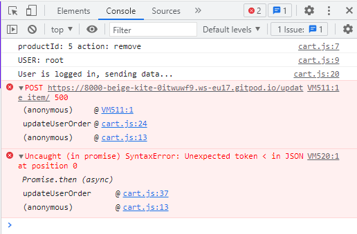

- Fixed syntax error by changing sign on remove portion which was trying to add and subtract simultaniously.

- JSON syntax error after putting in new cookie script.

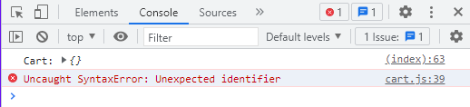

- Missed out on a + which meant script was not concatinating the string, crashing the script.

- Cart kept crashing as I tried to add info from the cookies to the page.

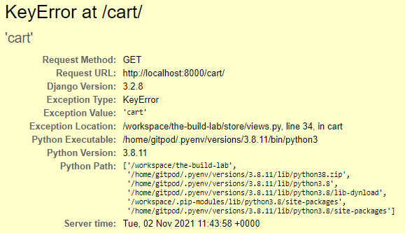

- Setting up a try/except with some temp data allowed the page to load with the correct data once it was fully loaded.

- Favicon won't show up, spent a little too much time on this, because it's not majorly important but it would have been nice...

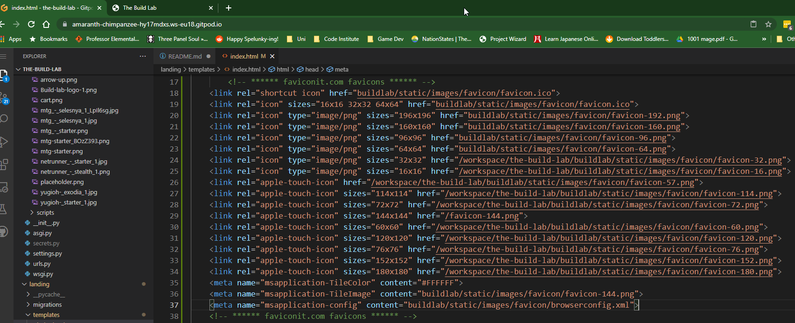

- server was trying to find/display the favicon but to no avail. Tried changing locations, icon type, had a range of sizes and browser conditions etc. etc.

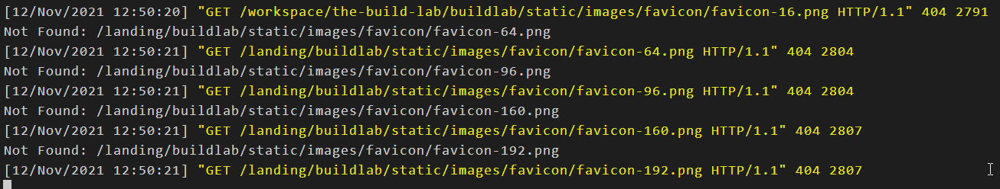

- Fontawesome is having issues with version 5, and working on version 6 so it just wouldn't work for me. Had to give up on those icons.

- Images were not properly rendering from the database, even though names and descriptors were.

- Django docs had "import os" and other methods for tracking paths and directories through local files. Working on gitpod many of these did not work, including with linking authentication templates. This had me going down many rabbit-holes and researching how to fix it. There were many things about building DIR paths but nothing worked for the longest time. Eventually I rebuilt where my folders and files were and this sorted a couple of major issues.

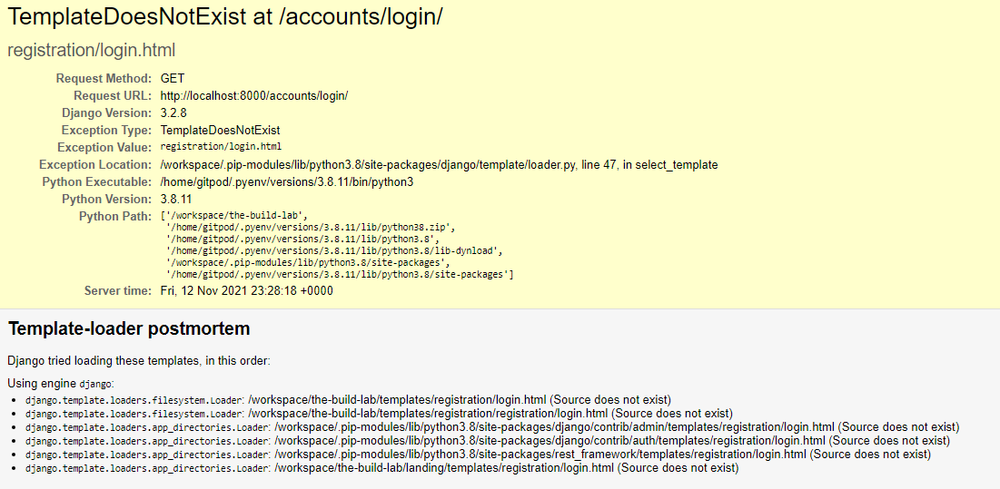

- infuriating error when updating models. Terminal just keeps saying a value is too long, but not what value or even which model. I've tried them all individually and NOTHING. ready to pull my hair out. 

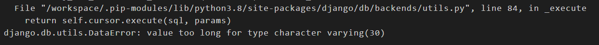

- Turns out that was an issue with datetime having a large character count and corrupting memory on another column. Rolled back to an old makemigrate and slowed things down to find the issue.

- Messing with a custom user class (Customers) has been a mistake basically the entire project. I thought I was giving myself more freedom, and using better coding practices. I was wrong. I've run into issue after issue with this. I only really realised this on my second last day. It might be too late. This might be what finally fails me on this disaster project.

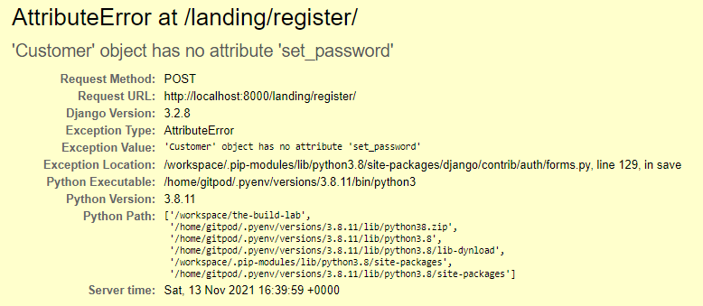

- Getting a 'No reverse match' error when rendering the base page which hasn't been edited in a long long time. Say's 'terms' can't be reverse matched. 

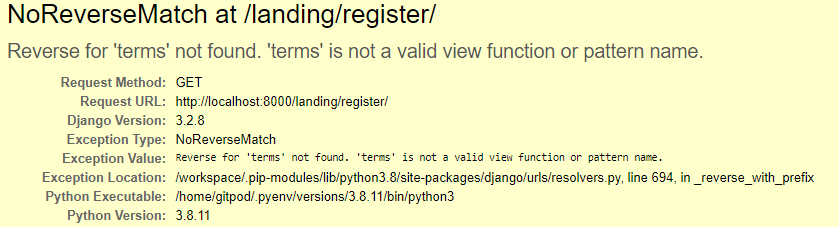

- Navbar view is incredibly inconsistent. Shows areas that should be off limits depending on if you're logged in/out, and premium only areas regardless of who is logged in. very confusing and frustrating because my logic looks sound.

## Deployment

1. Create repo "cardboard_craic" on Github based on Code-institute template.

2. Open workspace on Gitpod.

3. Install: updated pip, Flask, flask-pymongo, dnspython.

4. Create environments file env.py, and add this (and pycache) to gitignore for security.

5. create requirements.txt with pip3 freeze, create Procfile.

6. Log into MongoDB, join free cluster.

7. Create database cardboard_craic on free cluster.

8. Create collections on this database: games, genres, users, reviews as per schema.

9. Insert initial documents to these collections to test connectivity etc.

10. Back on Gitpod workspace create app.py and wire it up to the env.py.

11. Create first @app.route("/") and define a test page.

12. Go to Heroku.com and log in.

13. Create app cardboard_craic.

14. Go to Deploy and click deploy via Github. 

15. Put in Github username and repo name, make sure the correct repo opens.

16. Go to settings and click Reveal Config Vars. Add all info from env.py to this as it won't be picked up through Github (gitignore).

17. Back to deploy page click "Automatically deploy from branch: Master".

18. Wait to see this light up green. 

19. You can now "Open App" and will see the test page you created.

20. Live app:  

## Credits

### Content

- Window height calculations modified from http://martinpennock.com/blog/force-footer-bottom-page-css/

- checkout buttons and logic modified from https://codewithsteps.herokuapp.com/part/58e22993-f5a4-4ed7-92df-aede6711bf69/

- Script to generate CSRF token taken from https://docs.djangoproject.com/en/3.2/ref/csrf/

- Script to generate cookie to store session data modified from above by divanov11 on Github https://github.com/divanov11/ecom_steps/blob/master/m4-p1-s1-setcookies.html

- silly showcase SVG squiggle effect on index page: https://css-tricks.com/having-fun-with-link-hover-effects/

### Media
- Page logo designed and created by me on https://sketch.io/sketchpad/
- Schema created by me on https://creately.com/

### Acknowledgements
Thank you to my wife and friends who tested the site during development.
Thank you to Colin from code institute student care who supported me and fought in my side to get an extension when my ADHD diagnosis came through.